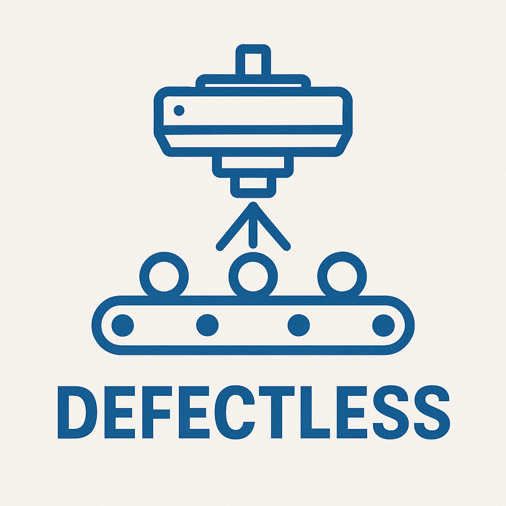

<div align="center">
    
    <p><code>MAKING TYPESCRIPT CODE SAFE, PREDICTABLE AND RELIABLE</code></p>
</div>

[](http://npm.im/defectless)


`defectless` is a library for writing safe and predictable programs in Typescript - without surprises,
silent failures, or hidden bugs.
It helps developers model both success and failure clearly, and catch everything that could go wrong.

`defectless` is perfect for complex applications with multiple points of failure that rely heavily on `Promises`.

It’s primarily about types and conventions: no runtime dependencies, only a tiny footprint (~6 KB), and in return you
get an unparalleled level of correctness and safety.

Written in pure, environment-agnostic TypeScript, `defectless` runs anywhere JavaScript does: Node, Browser, Deno, Bun,
serverless platforms, edge runtimes, even embedded devices.

# Why defectless?

- A simple concept: _a Promise with a typed error channel_.
- No complicated functional programming: just clear, explicit flows.
- Native to TypeScript/JavaScript: built for real-world TS apps, not a port of Rust or Haskell ideas.
- Seamless sync + async composition: no explicit conversions - perfect for the JavaScript world where both coexist.
- Bulletproof safety, without heavy runtime.
- Lightweight DX and simple learning curve.

# First Glimpse

A fragile and unpredictable function:

```typescript
// Method signature describes the success type
// but says nothing about potential failures
async function loadConfigFile(filename: string): Promise<ConfigSchema> {
  const content = await fs.readFile(filename, 'utf-8'); // may fail (filesystem error)
  const json = JSON.parse(content); // may fail (invalid JSON)
  return zodSchema.parse(json); // may fail (schema mismatch)
}
```

The same function, made safe with `defectless`:

```typescript
// Signature explicitly declares all possible failures
function loadConfigFile(
  filename: string,
): Outcome<ConfigSchema, FsError | JsonParsingError | ValidationError> {
  return readTextFile(filename).flatMap(parseJson).through(validateConfig);
}

// Each risky operation is wrapped in an Outcome,
// and possible errors are modeled explicitly.

function readTextFile(filename: string): Outcome<string, FsError> {
  return Outcome.fromSupplier(
    () => fs.readFile(filename, 'utf-8'),
    (err) => new FsError(`Failed to read file ${filename}`, err),
  );
}

const parseJson: (content: string) => Outcome<any, JsonParsingError> = Outcome.fromFunction(
  (c) => JSON.parse(c),
  (err) => new JsonParsingError('Failed to parse JSON content', err),
);

function validateConfig(json: any): Outcome<any, ValidationError> {
  const parseResult = zodSchema.safeParse(json);

  if (parseResult.success) {
    return success(json);
  } else {
    return failure(new ValidationError('Config validation failed', parseResult.error.issues));
  }
}
```

# Philosophy

`defectless` is a framework for correctness. It enables developers to write complex programs without overlooking a
single pitfall. It is designed for both **synchronous** and **asynchronous** code, and both types of flows can be
seamlessly composed.

To achieve this goal, `defectless` follows these principles:

### 1. Uncompromising syntax

That may look verbose and intimidating at first, but leaves no room for mistake.

### 2. No Shortcuts in Error Handling

`defectless` doen't allow to ignore, swallow or hide rising errors. Every posible outcome should be handled explicitly.

### 3. Unified Composition of Sync and Async Flows

`defectless` makes it easy to compose both synchronous and asynchronous logic in the same flow.

### 4. Async by Default

All flows in `defectless` are asynchronous, unless declared synchronous explicitly. The first asynchronous operation
in the flow automatically escalate the flow to asynchronous mode.

### 5. No Error Goes Unnoticed

Every error - whether anticipated or unexpected - is caught and channeled through the system.
No swallowed exceptions. No `try/catch` black holes.
`defectless` makes error surfaces visible and typed.

### 6. Defects Must Surface

`defectless` separates failures from bugs. Unanticipated or uncatchable failures are classified as defects -
and they will manifest at the terminal operation.

# Outcomes

`defectless` revolves around objects called **Outcomes**. An Outcome represents the result of code execution - either
a success or a failure. You can think of Outcomes as _"Promises with a typed error channel."_

```typescript
// API with Promise; only success values are typed
function readTextFile(filename: string): Promise<string>;

// API with Outcome; both success and failures are typed
function readTextFile(filename: string): Outcome<string, FsError>;
```

While `Outcome` is not a subclass of `PromiseLike` and cannot be directly used with `async/await`,
it offers very similar semantics.

There are two kinds of Outcomes in `defectless`: `AsyncOutcome` and `SyncOutcome`.
They compose seamlessly together, and most of the time no explicit conversion is needed.

Asynchronous flows are the default in `defectless`, because most real-world applications rely on asynchronous calls
to external systems - such as file system operations, service requests, or background workers.

`SyncOutcome` is a special case representing the result of purely synchronous execution.
It must be declared explicitly. If any asynchronous operation appears in a synchronous flow,
the entire flow automatically escalates to asynchronous mode.

Outcomes expose a rich set of functional methods for transforming values and errors, performing side effects,
recovering from failures, and finalizing flows.

And while functional programming is powerful, the real magic of `Promise`s often comes from `async/await`,
which lets developers write asynchronous code in a pseudo-linear style.
`defectless` provides a very similar mechanism: you can compose Outcomes in a pseudo-linear manner using
**generator functions**. This allows developers to write clear, procedural-looking code while still benefiting
from the robust failure handling provided by `defectless`.

In addition to anticipated and expected failures, `defectless` also catches every error thrown within the
flows it manages. These errors are classified as **defects** - in other words,
actual bugs in your software.
Defects are preserved and resurface at the end of the flow, when the `Outcome` is unwrapped.

## Introducing defectless into your code

`defectless` is a **progressive library**. This means you can migrate only the parts of your code that require
particular care, instead of rewriting everything at once.

That said, it’s usually best to transform flows into `defectless` flows **end to end**.
To achieve this, Outcomes should be **wrapped and unwrapped at the edges** of your application.

The _edges_ are the boundaries where your application interacts with external systems - for example:

- calls to the operating system or file system,
- database queries,
- usage of third-party libraries,
- handling of HTTP requests.

**Rule of thumb**: wrap every call to code you don’t control into an `Outcome`,
and unwrap only when you need to return results to an external consumer
(console output, database write, HTTP response, etc.).
Inside your application, work directly with `Outcome`s.

### Example

Wrapping a risky method like `fs.readFile` into an `Outcome`:

```typescript
// Wrap invocation of fs.readFile into an Outcome
export function readTextFile(filename: string): Outcome<string, FsError> {
  return Outcome.fromSupplier(
    () => fs.readFile(filename, 'utf-8'),
    (err) => new FsError(`Failed to read file ${filename}`, err),
  );
}
```

Unwrapping an `Outcome` only at the boundary, before writing to console:

```typescript
// listDocuments returns Outcome<Document[], SomeError>
// It needs to be unwrapped before printing to console
await listDocuments(store).match(
  (documents) => console.log(documents),
  (err) => console.error(err),
  (defect) => console.error(defect),
);
```

### General Advices

To get the most out of `defectless`, follow these simple rules:

- Wrap and unwrap `Outcome`s **only at the edges** of your application.
- **Wrap risky** system calls or throwing methods from libraries, so the entire data flow remains safe.
- Use `SyncOutcome` only when necessary to emphasize that an **operation is purely synchronous**.
  Otherwise, prefer the generic `Outcome`.
- **Never return** `null` or `undefined` from a method returning an `Outcome`. Instead, return `success()` with no value.
- **Never use** `throw` inside your code - model errors as failures instead.
- `Outcome`s represent **results, not inputs**. Don’t pass them as function parameters; return them from operations.
- Leverage defects for bug reporting - every defect represents **an actual bug** in your program.

## Getting Started

Let’s dive into `defectless`. The first step is to add it to your TypeScript project:

```shell
npm install defectless
```

Everything `defectless` provides can be imported directly from the module:

```typescript
import { Outcome } from 'defectless';
```

`Outcomes` are the core utility classes provided by `defectless`. They represent the foundation of the library.  
To make your code safe and predictable, you should create an `Outcome` as soon as your code performs its first risky
operation, and unwrap it only when you need to return the result to an external consumer.

### Creating Outcomes from literals

There are multiple ways to create `Outcome`s. The simplest is creation from literals:

```typescript
import { success, failure } from 'defectless';

// Create succeeded Outcomes
success(); // SyncOutcome<void, never> - success with no value
success(42); // SyncOutcome<number, never> - success with value 42
success({ id: 1, name: 'test' }); // SyncOutcome<{ id: number; name: string }, never>

// Create failed Outcomes
failure(); // SyncOutcome<never, void> - failure with no value
failure('Something went wrong'); // SyncOutcome<never, string> - failure with a string error
failure(new Error('Invalid input')); // SyncOutcome<never, Error> - failure with an Error
```

Outcomes created with `success` and `failure` are **explicitly synchronous**.
They can be used in synchronous flows without escalating the flow to asynchronous mode.

> [!WARNING]  
> `success` and `failure` are intended **only for wrapping literals**.
> They are not designed to wrap the return values of function calls or variables.  
> Why? Because if you wrap a function call directly, that call executes **outside the defectless flow**,
> and any errors it throws will escape uncaught.  
> To wrap function or method invocations safely, always use `Outcome.fromSupplier` or `Outcome.fromFunction`.

```typescript
// ❌ Don’t do this!
// defectless cannot catch errors thrown by riskyFunction
const value = riskyFunction();
const outcome = success(value);

// Or worse:
const outcome = success(riskyFunction());

// ✅ Do this instead
// so the risky invocation is secured inside the defectless flow
const outcome = Outcome.fromSupplier(() => riskyFunction());

// Or, for functions with parameters:
const outcome = Outcome.fromFunction((p) => otherRiskyFunction(p))(param);
```

### Creating Outcomes from suppliers or from functions

Wrapping existing throwing functions is the **main way** to create an `Outcome`.
While you’ll sometimes create them from literals, most of the time you’ll be wrapping calls to code outside your
direct control - such as system APIs or third-party libraries.

For this, use the static methods `Outcome.fromSupplier` and `Outcome.fromFunction`:

- Both methods accept a factory function that produces either a plain value or a `Promise`.
- Both take an optional **error handler**: a function that intercepts any thrown error or rejected `Promise`
  and converts it into a managed failure.
- Providing an error handler is **highly recommended** - otherwise, underlying failures will be treated as **defects**.

```typescript
import { Outcome } from 'defectless';

declare function riskyFunction(): Promise<number>;

// Using fromSupplier with an async function
const outcome1 = Outcome.fromSupplier(
  () => riskyFunction(),
  (err) => new ManagedError(err),
);
// => AsyncOutcome<number, ManagedError>

// Using fromFunction with a synchronous function
const outcome2 = Outcome.fromFunction(
  JSON.parse,
  (err) => new JsonParsingError('Failed to parse JSON', err),
)('{ "value": 42 }');
// => SyncOutcome<any, JsonParsingError>
```

### Transforming Outcomes

Once an `Outcome` has been created, most of your code will focus on **transforming and combining** them.  
`Outcome` exposes a wide range of convenient functional methods to work with both success and failure states.

> [!IMPORTANT]  
> Defected `Outcome`s cannot be transformed. Once an unanticipated error occurs in a defectless flow,
> all subsequent operations are skipped, and the defect resurfaces during the final unwrapping.

Here is the list of available transformation methods (each will be detailed in the following chapters):

- `map`
- `tap`
- `mapFailure`
- `tapFailure`
- `flatMap`
- `through`
- `recover`
- `finally`

#### map and tap

`map` and `tap` are the most basic operations on an `Outcome`.

- `map` transforms the success value.
- `tap` performs a side effect on the success value without changing it.

These operations run **only on successful Outcomes**.
If the Outcome is a failure or a defect, they are skipped and the flow continues unchanged.

```typescript
import { Outcome } from 'defectless';

declare const outcome: Outcome<string, unknown>; // Outcome containing string "42"

const mapped = outcome.map((value) => parseInt(value));
// mapped: Outcome<number, unknown> containing number 42

const tapped = outcome.tap((value) => console.log(`value is ${value}`));
// tapped: Outcome<string, unknown> containing string "42"
// logs: "value is 42"
```

`map` and `tap` never change the nature of the flow.
If the original Outcome is synchronous, the result will remain synchronous.

#### mapFailure and tapFailure

`mapFailure` and `tapFailure` are the counterparts of `map` and `tap`, but for the **error channel**.

- `mapFailure` transforms the failure value.
- `tapFailure` performs a side effect on the failure without changing it.

These operations run **only on failed Outcomes**.
If the Outcome is a success or a defect, they are skipped and the flow continues unchanged.

```typescript
import { Outcome } from 'defectless';

declare const outcome: Outcome<Product, number>; // Outcome containing failure 404

const mapped = outcome.mapFailure((code) => {
  switch (code) {
    case 404:
      return 'Resource not found';
    case 500:
      return 'Internal server error';
    default:
      return 'Unknown error';
  }
});
// mapped: Outcome<Product, string> containing failure "Resource not found"

const tapped = outcome.tapFailure((code) => {
  analytics.track('product_lookup_failed', {
    errorCode: code,
    message: MESSAGES[code],
  });
});
// tapped: Outcome<Product, number> still containing failure 404
// side effect: error is tracked
```

`mapFailure` and `tapFailure` never change the nature of the flow.
If the original Outcome is synchronous, the result will remain synchronous.

#### flatMap and through

`flatMap` and `through` are like `map` and `tap`, but they work with functions that return Outcomes.
These are the operators that **can change the nature of the flow**: if the function returns an `AsyncOutcome`,
the result will also be an `AsyncOutcome`.

- `flatMap` transforms the success value by applying a function that returns another `Outcome`.
- `through` sequences a side-effect that returns an `Outcome`, propagates its failures,
  and preserves the original success value when it succeeds.

These operations run **only on successful Outcomes**.
If the Outcome is a failure or a defect, they are skipped and the flow continues unchanged.

```typescript
import { Outcome } from 'defectless';

declare function loadContent(filename: string): Outcome<string, FsError>;
declare function parseJson(content: string): Outcome<any, JsonParsingError>;
declare function validateJson(json: any): Outcome<void, ValidationError>;

const outcome = loadContent('file.json');
// => Outcome<string, FsError>  (file contents or FsError)

const parsed = outcome.flatMap((content) => parseJson(content));
// => Outcome<any, FsError | JsonParsingError>  (parsed JSON or error)

const validated = parsed.through((json) => validateJson(json));
// => Outcome<any, FsError | JsonParsingError | ValidationError>
//    On success: original parsed JSON (unchanged)
//    On failure: the error from validateJson (or earlier steps)
```

#### recover

The `recover` operation allows you to **recover from a failure** and resume a normal flow.  
The recovery function receives:

- the main error, and
- any suppressed errors,

and returns another `Outcome` whose result type must match the original Outcome’s success type.

This operation runs **only on failed Outcomes**.  
If the Outcome is a success or a defect, it is skipped and the flow continues unchanged.

> [!WARNING]  
> `recover` does **not handle defects**. Defects represent unexpected, untyped bugs in your code.
> They are preserved and surface only during the final unwrapping.

`recover` can change the nature of the flow:
if the recovery function returns an `AsyncOutcome`, the result will also be an `AsyncOutcome`.

```typescript
import { Outcome } from 'defectless';

declare function fetchFromNetwork(productId: string): Outcome<Product, NetworkError>;
declare function getFromCache(productId: string): Outcome<Product, CacheError>;

const outcome = fetchFromNetwork('toy42').recover((mainError, suppressed) => {
  // Inspect or log the errors...
  return getFromCache('toy42');
});
// => Outcome<Product, CacheError>
//    - On success: product retrieved from network or cache
//    - On failure: CacheError
//    - NetworkError is considered handled and does not appear in the resulting failure type
```

#### finally

Executes a finalization step that always runs, whether the original `Outcome` succeeds or fails.  
This method implements a **try/finally** pattern for Outcomes, ensuring the finalization function always
executes regardless of the outcome’s state.

This is the only operation that can produce **suppressed failures**.
If `finally` runs on a failed `Outcome` and the finalization itself also fails,
the finalization error is added to the result as a suppressed failure.
This prevents the classic JavaScript `try/catch` black hole where cleanup errors are silently lost.

> [!WARNING]  
> `finally` is **not executed**, if the original Outcome is defected.

`finally` can change the nature of the flow:
if the finalization function returns an `AsyncOutcome`, the result will also be an `AsyncOutcome`.

```typescript
import { Outcome } from 'defectless';

declare function fetchFromDB(userId: string): Outcome<User, TimeoutError>;
declare function closeDB(): Outcome<void, DBError>;

const outcome = fetchFromDB('alice').finally(() => closeDB());
// => Outcome<User, TimeoutError | DBError>
// closeDB is always executed, whether fetchFromDB succeeds or fails
```

### Combining Outcomes

Chaining Outcomes with functional methods is not the only way to combine them.
`defectless` also provides two additional options:

- `Outcome.all` - a static function for parallel evaluation of multiple Outcomes.
- **Defectless programs** - a convenient utility for writing pseudo-linear code with Outcomes,
  similar in style to `async/await`.

#### Outcome.all

The static method `Outcome.all` evaluates the results of multiple `Outcome`s at once.
It is similar to `Promise.all`, but with full error handling.

This method works with both **homogeneous and heterogeneous arrays**:

- Outcomes with different result and failure types,
- Mixed arrays of `SyncOutcome`s and `AsyncOutcome`s.

The resulting `Outcome` contains:

- An array of success values if all inputs succeed, or
- An array of failures if one or more inputs fail.
  - Each failure appears at the same index as its original Outcome.
  - Successful positions are represented as undefined.

This method follows **fail-fast behavior**: if any `Outcome` is defected, the result is immediately that defect.

The return type depends on the inputs:

- If **all inputs** are `SyncOutcomes` -> returns a `SyncOutcome`.
- Otherwise -> returns an `AsyncOutcome`.

```typescript
import { Outcome, success, failure } from 'defectless';

const allSuccess = Outcome.all([success('hello'), success(42), success(true)]);
// => SyncOutcome< [string, number, boolean], never >
//    success with ["hello", 42, true]

const someFailures = Outcome.all([
  asyncFetchProduct_successful(), // assumed: AsyncOutcome<Product, NetworkError>
  failure('oops!'),
  success(42),
  failure({ code: 404, msg: 'Resource not found' }),
]);
// => AsyncOutcome< never, (string | { code: number; msg: string } | NetworkError)[] >
//    failure with [ undefined, "oops!", undefined, { code: 404, msg: "Resource not found" } ]
```

#### Defectless programs

Defectless programs are a convenient way to write **pseudo-linear code** with `Outcome`s.
While functional programming is powerful, the real magic of `Promise`s comes from `async/await`.

`Outcome`s are not Promises, so they cannot be used directly with `async/await`. Instead,
`defectless` provides a similar mechanism using **generator functions**.
This may look intimidating at first, but once mastered it unlocks the full power of `defectless`.

A familiar async/await example:

```typescript
declare function cacheContains(id: number): Promise<boolean>;
declare function getFromCache(id: number): Promise<Document>;
declare function putIntoCache(id: number, doc: Document): Promise<Document>;
declare function getFromDb(id: number): Promise<Document>;

// Using async/await
async function loadDocument(id: number): Promise<Document> {
  const docInCache: boolean = await cacheContains(id);

  if (docInCache) {
    return getFromCache(id);
  }

  const document: Document = await getFromDb(id);
  return putIntoCache(id, document);
}
```

This function is declared `async` and uses `await`, giving it a clean, linear, procedural style.

Rewriting with `defectless`:

```typescript
import { Outcome, Program, program } from 'defectless';

declare function cacheContains(id: number): Outcome<boolean, CacheError>;
declare function getFromCache(id: number): Outcome<Document, CacheError>;
declare function putIntoCache(id: number, doc: Document): Outcome<Document, CacheError>;
declare function getFromDb(id: number): Outcome<Document, DbError>;

function loadDocument(id: number): Outcome<Document, CacheError | DbError> {
  return program(
    // program replaces async
    function* (): Program<Document, CacheError | DbError> {
      const docInCache: boolean = yield cacheContains(id); // yield replaces await

      if (docInCache) {
        return getFromCache(id);
      }

      const document: Document = yield getFromDb(id);
      return putIntoCache(id, document);
    },
  );
}
```

Here we rewrote the code using `Outcome`s while preserving the original linear style:

- The `async` keyword is replaced with `program` from `defectless`.
- The function body is a generator.
- Every `await` becomes a `yield`.

The program executes until the first failed `Outcome` is yielded, or until it returns.
A program may return either:

- an `Outcome`, or
- a plain value (automatically wrapped as a success).

The type of the returned value or `Outcome` must match the declared `Program` type.

##### Sync vs Async programs

A defectless program can yield and return both `SyncOutcome`s and `AsyncOutcome`s.
However, the result is always a generic `Outcome`, which is **assumed asynchronous**.

If you want to enforce a program to be purely synchronous:

- Declare it as a `SyncProgram`.
- Yield and return only `SyncOutcomes`.

```typescript
function safeDivision(dividend: number, divisor: number): SyncOutcome<number, MathError> {
  return program(
    // In SyncProgram, both yielded and returned values are explicitly synchronous
    function* (): SyncProgram<number, MathError> {
      if (divisor === 0) {
        yield failure(new MathError('Cannot divide by zero'));
      }

      const result: number = dividend / divisor;
      return success(result);
    },
  );
}
```

##### Binding 'this'

Generator functions don’t have access to `this` by default.
To use `this` inside a defectless program body, pass it as the **second parameter** to `program`.  
This is useful when implementing class methods that need access to instance attributes or methods.

```typescript
program(
  function* (): Program<Option<Document>, JsonParsingError | FsError> {
    const doc = yield this.loadDocument(filename); // using `this`

    yield rmFile(filename);

    if (yield isDirectoryEmpty(documentDir)) {
      yield rmDirectory(documentDir);
    }

    return doc;
  },
  this, // bind `this` to the generator function
);
```

##### Defect handling

If any `Outcome` yielded or returned by the generator is a **defect**,
the program halts immediately and returns that defect.  
If an unexpected error is thrown inside the generator body, `program` also returns a defect.

### Unwrapping Outcomes

When an `Outcome` reaches the **edge of the application** - where results must be sent to an external system
(HTTP response, console output, database write, etc.) - there is no other choice but to **unwrap it**.

Unwrapping an `Outcome` surfaces possible **failures** and **defects**, which must be handled explicitly.

The main way to unwrap is with the `match` method, which executes one of three handlers depending
on the state of the `Outcome`:

- success handler
- failure handler
- defect handler

Regardless of whether the flow is synchronous or asynchronous, `match` always returns a `Promise<void>`
and should be `await`ed.

```typescript
await loadDocument(42).match(
  (doc) => console.dir(doc),
  (err) => console.error(err),
  (defect) => console.error(defect),
);
```

#### Extracting values

If you want to extract the result of an `Outcome` into a variable, you must do it inside the appropriate handler.

```typescript
// Type-safe value extraction
const numberOutcome = success(42);
let extractedValue: number | null = null;
let extractedError: string | null = null;

await numberOutcome.match(
  (value) => {
    extractedValue = value;
  }, // value is typed as number
  (error, suppressed) => {
    extractedError = error;
  }, // error is typed as never (no failures possible)
  (defect) => {
    console.error('Unexpected defect');
  },
);

// extractedValue is now 42
// extractedError remains null
```

#### matchSync

`SyncOutcome` provides an additional method `matchSync`, which executes synchronously and does not need to be awaited.
This is convenient when working with strictly synchronous flows.

```typescript
syncOutcome.matchSync(
  (value) => console.log(`Success: ${value}`),
  (error, suppressed) => console.error(`Failed: ${error}`),
  (cause) => console.error(`Defect: ${cause}`),
);
```

### Transforming async flow to sync

> [!WARNING]  
> In real-world code, you will almost never need to manually change the nature of a `defectless` flow.  
> If you think you do, double-check your design first.

`defectless` does not provide a method to convert a `SyncOutcome` into an `AsyncOutcome` - and you don’t need one.  
`AsyncOutcome` is considered the more **generic form**, and any asynchronous operation in a previously synchronous
flow will automatically escalate the entire flow into asynchronous mode.

The reverse, however, is different. Converting an `AsyncOutcome` into a `SyncOutcome` requires **awaiting** it first.

While this is rarely necessary (and usually discouraged), you can force such a transformation
using the `AsyncOutcome.sync` method:

```typescript
import { AsyncOutcome } from 'defectless';

declare const asyncOutcome: AsyncOutcome<User, NetworkError>;

const syncOutcome = await asyncOutcome.sync();
// => syncOutcome is SyncOutcome<User, NetworkError>
```

## Acknowledgment

`defectless` began as a fork and extensive rework of [neverthrow](https://github.com/supermacro/neverthrow).
Although none of the original `neverthrow` code remains, we are deeply grateful to
[@supermacro](https://github.com/supermacro) and [m-shaka](https://github.com/m-shaka)
for maintaining `neverthrow` over the years.
Without their contributions, `defectless` would not exist.

## Licence

This repository is licensed under the [MIT](LICENSE) license.
